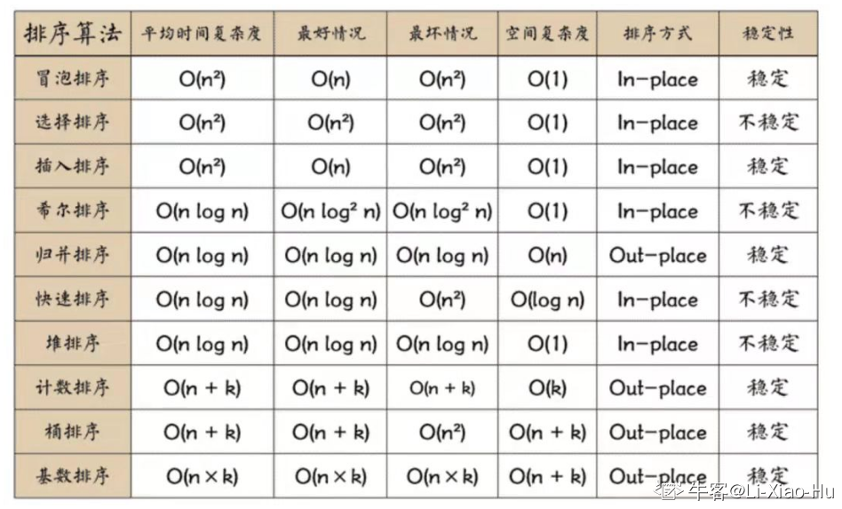

# 算法笔记

## 算法复杂度口诀
:::tip
选泡插n方(n^2),快归堆n老(nlogn)
:::



## 排序

### 冒泡排序
> 每轮比较相邻的两个元素，将大值靠后排
```js
/**
 * 思路：排序每一轮取到最大值置于每一轮的最后一位
 * @description 冒泡排序
 * @param array 待排序的数组
 */
function bubbleSort() {
  let len = array.length;
  for (let i = 0; i < len - 1; i++) {
    // 每一轮就会排出一个最大值，j就可以少比较一位
    for (let j = 0; j < len - 1 - i; j++) {
      if (array[j] > array[j+1]) {
        [array[j], array[j+1]] = [array[j+1], array[j]];
      }
    }
  }
}
```

### 选择排序
> 每轮找出最小值的下标，在本轮结束前与首位交换，每轮都能找到一个最小值
```js
/**
 * 思路：遍历数组，每轮找到最小值的下标并于第一位位置对换
 * @description 快速排序
 * @param array 待排序的数组
 */
function selectSort() {
  for (let i = 0; i < array.length - 1; i++) {
    // 设置最小值的下标
    let minIndex = i;
    for (let j = i+1; j < array.length; j++) {
      if (array[j] < array[minIndex]) {
        // 更新最小值的下标
        minIndex = j;
      }
    }

    // 每一轮走完，将 minIndex 与本轮首位调换
    [array[i], array[minIndex]] = [array[minIndex], array[i]];
  }
}
```