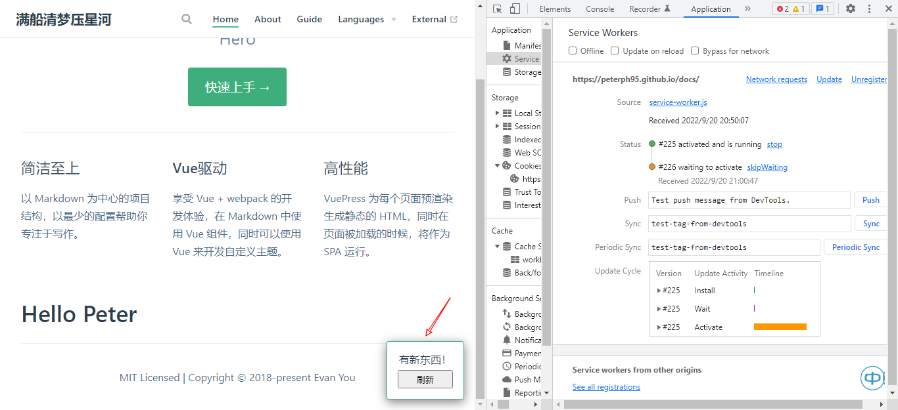

# Vuepress 笔记

## 插件`plugin`

### PWA
> 演示 pwa 的弹窗效果
> PWA 其中有一个能力就是把网站安装到系统桌面，以原生应用的体验来运行网站，使用户无需再开浏览器输入网址进入网站，而是可以直接点击安装好的应用直接运行，给使网站访问缩短路径及增加网站的曝光度。

### 这是测试`PWA`的内容
> 到底行不行啊？
> 还是老样子？？
> 爷不信邪！💢💢💢
> 💥💥💥
> 百折不挠 ψ(｀∇´)ψ
> 小意思
> 测试`pwa-popup`
> 10. 测试`skipWaiting: true`
> 11. `deploy`试试
> 12. 重装插件
> 13. 修改插件版本`"@vuepress/plugin-pwa-popup": "^2.0.0-beta.53"`