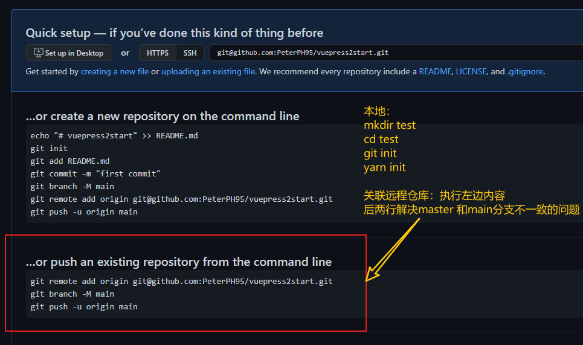

## 本地项目发布到`Github`
- 1. 新建远程仓库[new](https://github.com/new)
- 2. 进入项目文件夹，需先初始化`git init`，在git中执行脚本关联该仓库[Quick setup](https://github.com/PeterPH95/test)
- 3. 若要部署到`gh-pages`布置静态页面，参考[GitHub Pages](https://cli.vuejs.org/zh/guide/deployment.html#github-pages)


## 本地项目关联远程仓库



## 项目本地运行，修改端口号
```js
// package.json 文件中配置
"scripts": {
    "serve": "vue-cli-service serve --port 9090",
},
```