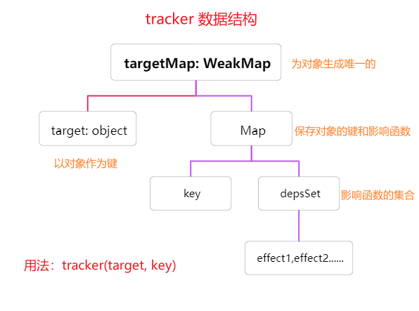
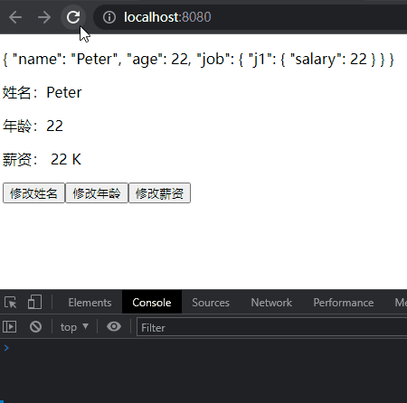

# Vue3 学习笔记

## `Vue3`响应式原理手动实现

### 涉及函数
- `reactive`：响应式，在`get`中调用`tracker`，在`set`中调用`trigger`，实现视图更新
- `effect`：副作用函数，接收渲染函数
- `tracker`：依赖收集，接收`effect`
   
- `trigger`：依赖更新，调用`tracker`收集的`effect`集合


### `reactive`
- 实现响应式的基础，内部通过`ES6`的新特性`Proxy`来实现数据劫持
- 相比于`Vue2`中的`Object.defineProperty`方式的优点：
  - 可以监测对象属性的添加和删除
  - 可以检测通过下标修改数组

```js
// reactive.js
import { traker, trigger } from "./effect.js";

const isObject = (target) => target !== null && typeof target == "object";
export const reactive = (target) => {
  return new Proxy(target, {
    get(target, key, receiver) {
      let res = Reflect.get(target, key, receiver);
      traker(target, key);
      // 如果值为对象，递归调用
      if (isObject(res)) {
        return reactive(res);
      }
      return res;
    },
    set(target, key, newValue, receiver) {
      let res = Reflect.set(target, key, newValue, receiver);
      // 触发更新
      trigger(target, key);
      return res;
    },
  });
};
```

### `effect`、`tracker`、`trigger`在一个`js`文件中
- `effect`：模板更新函数，接收一个回调函数（该回调函数操作实际的`DOM`，渲染页面）
- `tracker`：通过对象(`target`)和键(`key`)，收集该对象对应键的依赖函数`effect`
- `trigger`：当对象(`target`)的键(`key`)对应的属性改变时，调用`tracker`中收集的该对象(`target`)中对应键(`key`)的依赖函数

```js
// effect.js
/**
 * @activeEffect 闭包变量保存渲染函数
 * @fn 渲染函数
 * @return void
 */
let activeEffect;
export const effect = (fn) => {
  const _effect = function () {
    activeEffect = _effect;
    fn();
  };
  _effect();
};

/* tracker */
/**
 * @description 收集 activeEffect
 * @target 被 track 的对象
 * @key 被 track 对象的 key
 */ 
const targetMap = new WeakMap();
export const traker = (target, key) => {
  let depsMap = targetMap.get(target);
  if (!depsMap) {
    depsMap = new Map();
    targetMap.set(target, depsMap);
  }
  let deps = depsMap.get(key);
  if (!deps) {
    deps = new Set();
    depsMap.set(key, deps);
  }
  // 关键：收集依赖
  deps.add(activeEffect);
};

/* trigger */
/**
 * @description 触发 effect
 */ 
export const trigger = (target, key) => {
  const depsMap = targetMap.get(target);
  const deps = depsMap.get(key);
  deps.forEach((effect) => effect());
};
```

### `HTML`部分
```html
<div id="app"></div>
<script type="module">
  import { reactive } from "./reactive.js";
  import { effect } from "./effect.js";

  const user = reactive({
    name: 'Peter',
    age: 22,
    a: {//测试深层嵌套
      b: {
        c: 1
      }
    }
  })

  // 传入渲染函数
  effect(
    () => document.querySelector("#app").innerText = `${user.name} - ${user.age} - ${user.a.b.c}`;
  )

  // 测试响应式原理
  setTimeout(() => {
    user.name = 'Jhon';
    setTimeout(() => {
      user.a.b.c = 12590;
    }, 1500);
  }, 1500)

</script>
```


## `Vue3`相对于`Vue2`的改变

## `watch`

### `Vue3`无法watch`oldValue`?[参考](https://www.bilibili.com/video/BV1Zy4y1K7SH?p=152&spm_id_from=pageDriver&vd_source=3222fe640ca9017c65847877e892e557)

```js
setup(){
	watch(person,(newValue,oldValue)=>{
		console.log('person变化了',newValue,oldValue)// 打印结果都是新值
	},{immediate:true}) 
}
```

### ❗❗监测`ref`和`reactive`数据的不同写法

```js
// `ref`数据 
let person = ref({// 内部对象实际借助 reactive
    name: 'Peter',
    age: 20
})
// 监视 refimpl 对象，这种方式无效(控制台不输出)，监视的仅仅是person地址
watch(person, (newValue,oldValue)=>{
		console.log('person变化了',newValue,oldValue)
})// 解决办法1 {deep: true}
// 解决办法2
watch(person.value, (newValue,oldValue)=>{
		console.log('person变化了',newValue,oldValue)
})

// `reactive`数据
let person = reactive({// 内部对象实际借助 reactive
    name: 'Peter',
    age: 20
})
// 直接监视 Proxy 对象
watch(person, (newValue,oldValue)=>{
		console.log('person变化了',newValue,oldValue)
})// 有效
```

### `shallowReactive`浅响应式的坑

- ❗虽然下面的`salary`属性不是响应式的，但是数据可以被修改，只是数据不是响应式的，修改第一层的`name`会间接改变`salary`
- 

```vue
<template>
  <p>{{ person }}</p>
  <p>姓名：{{ name }}</p>
  <p>年龄：{{ age }}</p>
  <p>薪资： {{ job.j1.salary }} K</p>
  <button @click="name += '!'">修改姓名</button>
  <button @click="age++">修改年龄</button>
  <button @click="job.j1.salary++">修改薪资</button>
</template>

<script>
import { toRefs, shallowReactive} from 'vue'
export default {
  name: 'App',
  setup() {
    let person = shallowReactive({
      name: 'Peter',
      age: 22,
      job: { j1: { salary: 22 } }
    })

    return {
      person,
      ...toRefs(person)
    }
  }
}
</script>
```

## `Vue3`项目笔记

### `Vue3`加`ts`出现 --找不到模块
- 看图：
[模块导入错误](./assets/vue3_@.png)
- 问题一：`ts`只支持导出导入模块，但是`vue`不是模块(我们需要申明一下`vue`是个模块，让你的`ts`可以导入)
  - 解决方式：在`src`目录下新建`env.d.ts`文件，声明`.vue`文件是模块
  ```ts
  declare module '*.vue' {
  import type { DefineComponent } from 'vue'
  const component: DefineComponent<{}, {}, any>
  export default component
  }
  ``` 
- 问题二：`@`别名的方式模块无法识别

### `ref`获取`Dom`
```js
<div ref="dom">hello</div>

const dom = ref<HTMLDivElement>()
console.log(dom.value?.innerText)
```