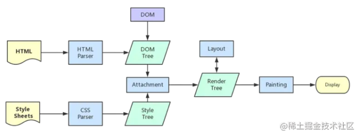
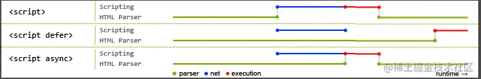

# 页面加载与渲染

## 浏览器输入url到页面展示出来的全过程
- [参考](https://blog.csdn.net/cute_ming/article/details/124364783?ops_request_misc=%257B%2522request%255Fid%2522%253A%2522166640878316782248545658%2522%252C%2522scm%2522%253A%252220140713.130102334..%2522%257D&amp;request_id=166640878316782248545658&amp;biz_id=0&amp;utm_medium=distribute.pc_search_result.none-task-blog-2~blog~top_click~default-2-124364783-null-null.nonecase&amp;utm_term=%E8%BE%93%E5%85%A5url%E5%88%B0%E6%98%BE%E7%A4%BA%E7%9A%84%E5%85%A8%E8%BF%87%E7%A8%8B&amp;spm=1018.2226.3001.4450)

## 浏览器渲染流程
> 页面生成的过程：
> 1.HTML 被 HTML 解析器解析成 DOM 树；
> 2.CSS  被 CSS 解析器解析成 CSSOM 树；
> 3.结合 DOM 树和 CSSOM 树，生成一棵渲染树(Render Tree)，这一过程称为 Attachment；
> 4.生成布局(flow)，浏览器在屏幕上“画”出渲染树中的所有节点；
> 5.将布局绘制(paint)在屏幕上，显示出整个页面。
>
> 第四步和第五步是最耗时的部分，这两步合起来，就是我们通常所说的渲染。




## CSS加载会造成阻塞吗？为什么，做过实验吗？怎么证明？

**结论**：

> 1. css加载不会阻塞DOM树的**解析**
> 2. css加载会阻塞DOM树的**渲染**
> 3. css加载会阻塞后面js语句的执行

参考：https://juejin.cn/post/6844903667733118983
页面渲染详细流程：https://juejin.cn/post/6844903784229896199

```html
/* 代码演示 */
<!DOCTYPE html>
<html lang="en">
  <head>
    <title>css阻塞</title>
    <meta charset="UTF-8">
    <meta name="viewport" content="width=device-width, initial-scale=1">
    <style>
      h1 {
        color: red !important
      }
    </style>
    <script>
      function h () {
        console.log(document.querySelectorAll('h1'))
      }
      setTimeout(h, 0)
    </script>
    <link href="https://cdn.bootcss.com/bootstrap/4.0.0-alpha.6/css/bootstrap.css" rel="stylesheet">
  </head>
  <body>
    <h1>这是红色的</h1>
  </body>
</html>
```

## 不会阻塞DOM解析的资源有哪些？

> 1. `<script async src=""></script>`
> 2. image标签
> 3. iframe标签（内嵌网页）

## DOMContentLoaded和window.onload的触发时机不同在哪？[参考](https://juejin.cn/post/6844903623583891469)

- **DOMContentLoaded**（意思是HTML**下载、解析**完毕之后就触发。）
> MDN的解释：当初始的 HTML 文档被完全加载（下载）和解析完成之后，DOMContentLoaded 事件被触发，而无需等待样式表、图像和子框架的完成加载。

- **load**（意思是页面的html、css、js、图片等资源都已经加载完之后才会触发 load 事件。）
> MDN的解释：**load** 应该仅用于检测一个完全加载的页面 当一个资源及其依赖资源已完成加载时，将触发load事件。

## defer和 async区别

[参考](https://juejin.cn/post/6992371218481414152) [参考2](https://juejin.cn/post/6894629999215640583) [图解参考三](https://www.growingwiththeweb.com/2014/02/async-vs-defer-attributes.html)

```js
对于 HTML 标签`<script src="script.js"></script>`。
<script src='xxx'></script>
<script src='xxx' async></script>
<script src='xxx' defer></script>
```

> 1. 既没有defer也没有async属性，则浏览器遇到该script标签时，会立即加载并执行指定的脚本。执行完毕后，才继续解析后面的标签。
> 2. 有async 属性，浏览器遇到该script标签时，加载脚本的过程与解析后面标签的过程同时进行。加载完毕后，单独执行该脚本。
> 3. 有defer属性，浏览器遇到该script标签时，加载脚本的过程与解析后面标签的过程同时进行。但是执行脚本的过程，在解析完所有元素之后才执行。可以这样理解：defer本身就有推迟的意思，在加载完脚本后，将执行过程推迟到最后。